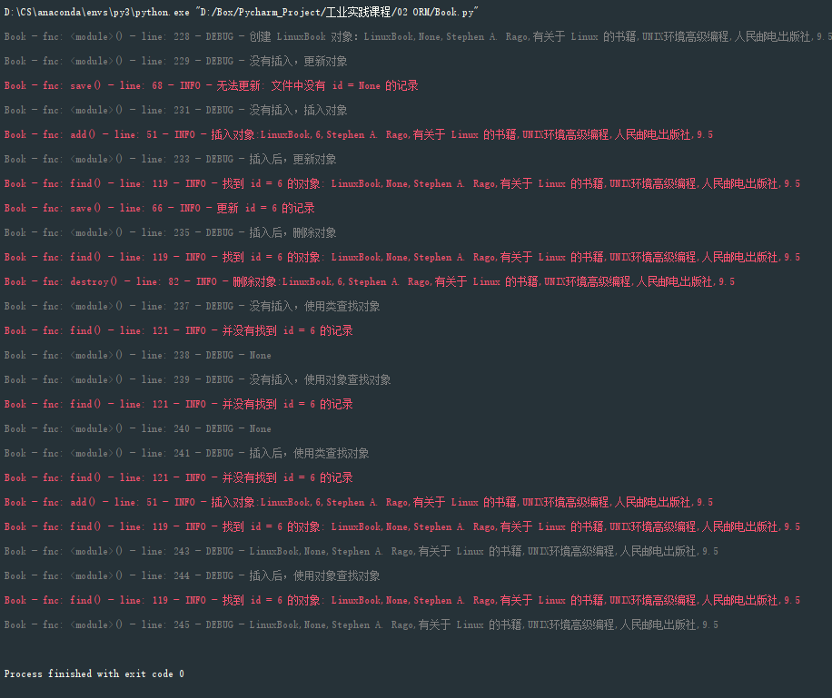

## 问题描述

在程序开发中，数据往往都是存储在数据库中，在面向对象的程序设计中同样如此。而数据库中的表与实体类并没有什么关联，将对象持久化时，通常使用硬编码的方式，为每一种可能的数据库访问都需要提供单独的方法。这样的作法不紧增加了代码量，而且缺乏弹性，在后期业务需求发生变化时，维护起来将会很困难。对于数据库来说，基本操作有四种：create（新建）、read（读取）、update（更新）和delete（删除），简称 CURD，使用硬编码的方式也主要进行着四个操作，根据封装变化原则将这些重复的部分封装起来，ORM 技术就是对于这部分内容的封装，以书为例，使用 python 实现一个简单的 ORM。

## 解决方案

ORM，即对象关系映射（Object-Relational Mapping）,将面向对象语言中的对象与关系数据库进行一个映射，使我们可以将对象持久化到关系数据库中，也可以用操作对象的方法来操作关系数据库。在本次实验中，简化对 ORM 的操作，规定每一个对象的属性都是字符串类型，将程序对象与文本文件进行映射，而不是与关系数据库进行映射，并实现对文件的 CURD 操作。每一个文本文件对应着一个类，文本中每一行对应着一个对象，文本中的每一行存在着多个行元素并用","分隔对应着对象属性，这样就与程序中的对象建立了映射关系。但这也要求了在定义每一个类时或在使用对象时，对象的属性只能用于存储需要保存的数据，不能有其他类型的属性，也就是常说的实体类。

| 数据库对象  | 程序对象       |
| ----------- | -------------- |
| 表-table    | 类-class       |
| 记录-record | 对象-object    |
| 字段-field  | 属性-attribute |

| 文本文件对象     | 程序对象       |
| ---------------- | -------------- |
| 文件-file        | 类-class       |
| 行-line          | 对象-object    |
| 行元素-line cell | 属性-attribute |

首先先创建一个基类 Book，接下来的所有类都将继承它，Book 类并没有与有效数据直接相关的属性，只定义了 id，file_path，file_basepath 三个属性，虽然不与直接数据相关，但是这三个属性也是不可缺少的， id 作为一条记录的唯一标识符用于在文件中查找和读取数据、file_basepath 和 file_path 定义了对象被存储的文件夹路径和文件路径，并且使用配置文件来 conf.ini 来确定。

除此之外，Book 类中定义了 CURD 四个基本操作，这四个操作是整个程序的关键，也是在实践操作中主要使用的方法，并且只需要在 Book 类中定义，无论子类是什么样子的，子类无需重写这四个方法，只需复用即可。CURD 四个基本操作访问的对象是对象的属性，但是对于不同的子类将会具有不同的属性，属性的名称、数量等都有可能不同，也就是说在定义好 Book 类后，Book 类本身是无法知道子类将会有什么样的属性，只有在子类真正运行并调用 CURD 四个基本方法时，才能够真正确定是哪个对象以及它应该有什么属性。是在运行状态中，对于任意一个类，都能够知道这个类的所有属性和方法；对于任意一个对象，都能够调用它的任意方法和属性；这种动态获取信息以及动态调用对象方法的功能称为反射机制。在 python 中使用 dir() 函数将会获取对象的所有属性的名称，然而对于 python 来说，一切皆是对象，不仅仅是相关属性会被获取，对象的方法、魔术方法等都会被获取到，所以需要进行一步的筛选。在获取到所有属性的名称后，我们将可以使用 getter() 函数来获取到属性对应的值。通过反射机制能够获取到对象在运行时刻的属性，也就可以直接进行 CURD操作。之后，只需要创建类来继承 Book 类，不需要修改 CURD 方法，就可以直接使用 CURD 方法，进行与文件间的映射。

| 基本操作 | 类/对象方法 | 方法    | 作用                                                         |
| -------- | :---------- | ------- | ------------------------------------------------------------ |
| Create   | 对象方法    | add     | 增   1.如果在文件中，则无法插入   2.如果不在文件中，则插入   |
| Update   | 对象方法    | save    | 改   1.如果在文件中，则更新   2.如果不在文件中，则提示无法更新 |
| Read     | 类方法      | find    | 查（根据id查询）   1.如果文件中不存在，返回None   2.如果文件中存在，则返回对象 |
| Delete   | 对象方法    | destory | 删   1.如果文件中不存在，则提示   2.如果文件中存在，则删除   |


举例

有关计算机的书 ComputerBook 类继承 Book 类，有关 Linux 的书 LinuxBook 类继承 Computer，不对任何的方法进行修改，只添加相应属性。

```python
  class ComputerBook(Book):
      def __init__(self, name="", star="", author="", public=""):
          """
          有关计算机的书
          :param name: 书名
          :param star: 评分
          :param author: 作者
          :param public: 出版社
          """
          super().__init__()
          self.name = name
          self.star = star
          self.author = author
          self.public = public
  class LinuxBook(CoumputerBook):
      def __init__(self, name="", star="", author="", public=""):
          super().__init__(name, star, author, public)
          self.des = "有关于 Linux 的书籍"
```

测试代码

```python
  if __name__ == '__main__':
      linux_book = LinuxBook("UNIX环境高级编程", "9.5", "Stephen A. Rago", "人民邮电出版社")
      logging.debug("创建 LinuxBook 对象：", linux_book)
      logging.debug("没有插入，更新对象")
      linux_book.save()
      logging.debug("没有插入，插入对象")
      linux_book.add()
      logging.debug("插入后，更新对象")
      linux_book.save()
      logging.debug("插入后，删除对象")
      linux_book.destroy()
      logging.debug("没有插入，使用类查找对象")
      logging.debug(Book.find(linux_book.id))
      logging.debug("没有插入，使用对象查找对象")
      logging.debug(linux_book.find(linux_book.id))
      linux_book.add()
      logging.debug("插入后，使用类查找对象")
      logging.debug(Book.find(linux_book.id))
      logging.debug("插入后，使用对象查找对象")
      logging.debug(linux_book.find(linux_book.id))
```

结果



## 归纳总结

ORM 简化了对象的持久化，便于把更多经历放在业务逻辑上。在本次实验中，对于对象的 CURD 也算是业务逻辑的一块，并没有与实体类相分离，类比到 MVC 模型中，CURD 操作属于 control ，而 实体类属于 Model，这两块应该是分离的，实体类只需关注自身的属性即可。在本次实验中，使用配置文件，动态的确定保存文件的位置；还使用到了日志模块，相比于传统的使用 print，日志能够展示的东西更多，而且能够对输出的等级进行分类、输出到不同地方等。