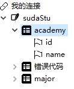

# 问题描述

图形用户界面（Graphical User Interface，简称 GUI，又称图形用户接口）是指采用图形方式显示的计算机操作用户界面。
在计算机普及的当今，GUI 的广泛应用使更多的人能够使用计算机的许多功能，使用 wxpython 为 sqlite 编写一个 GUI。

# 解决方案

## 类图

## 界面布局

1. 菜单栏

   **File**: 与文件有关的菜单。open 可以直接打开 sqlite3 文件；test 会打开存放在 ./resource/test/sudaStu.db ，用于测试。

2. 窗口主题

   用 wx.SplitterWindow 将窗口分割成两部分。

   **ShowGridPanel**：窗口的右半部分，用于用于展示数据，在默认状态下会绘制 5 × 10 的表格，当选中表时，将会展示表格数据。

   **DatabaseTreePanel**：窗口的左边部分，用于展示打开的数据库文件及其表、字段结构。

## 获取 sqlite 表结构

sqlite 是一种轻型的数据库，无需服务可以直接通过 python 连接，并且 sqlite 没有数据库的概念，直接存放着表。sqlite 中有一个内置表，名为 SQLITE_MASTER，此表中存储着当前数据库中所有表的相关信息，比如表的名称、用于创建此表的sql语句、索引、索引所属的表、创建索引的sql语句等，所以可以直接从这张表中，获取 sqlite 数据库中的所有的表名，在通过 pragma table_info() 来获取单个表的所有信息，这样一个 sqlite 数据库的所有结构都全部获得。将数据库名、表名、字段名构成一个树形结构，并加入到树形列表 TreeList 中，就可以得到如下图所示的结果。

如果无法打开 sqlite 文件，将会有提示窗口，提示无法打开以及无法打开的原因，如下图所示。

## 以表格的形式展示数据

当在树形列表中选中一个表时，将会触发 wx.EVT_TREE_SEL_CHANGED 事件，ShowGridPanel 便会选中表中所有记录并展示在表格中。由于可能会在多张表中切换，不同的表具有不同的行数、列数和数据，会使表格重绘几次，默认的绘制方法只针对绘制同一个结构的数据有效，当行数、列数发生改变时，将会有以前的数据重叠在一起，所以需要重写存放表格数据的类 wx.grid.GridTableBase ，并更具情况重写几个需要用到的方法。

